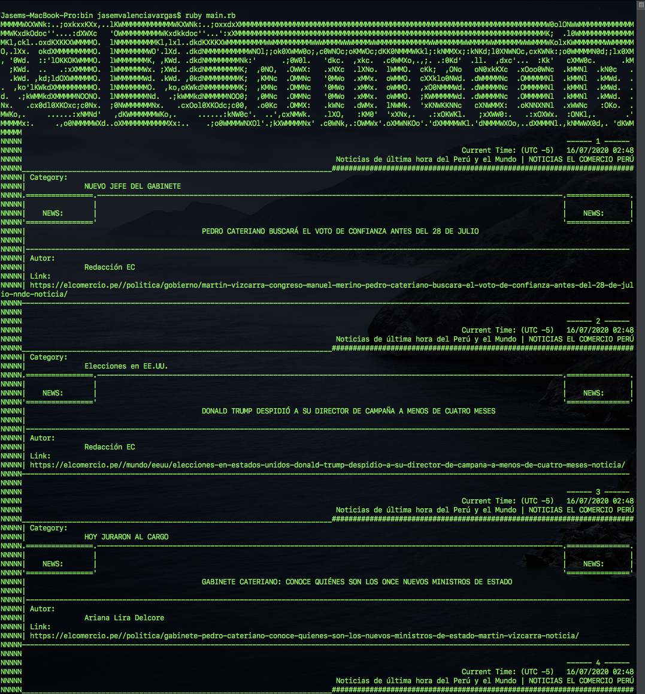
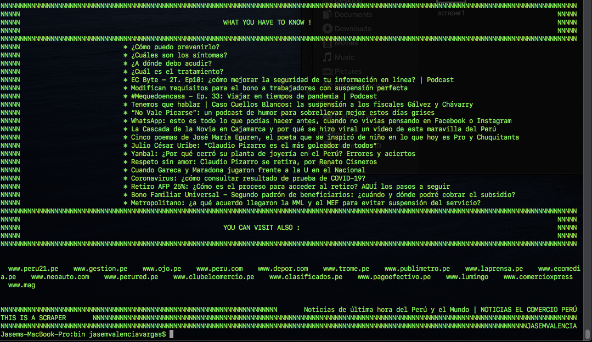
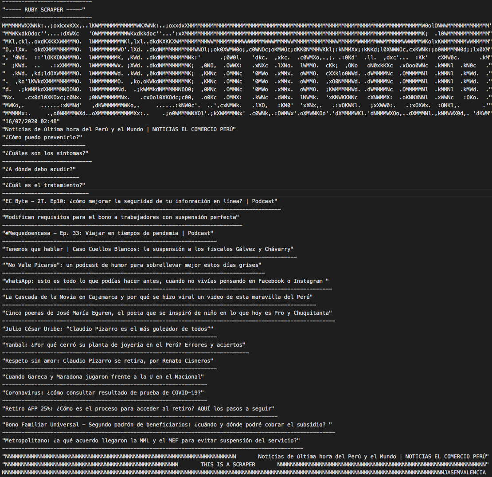

# Scraping_with_ruby    🚀 
This a scraper using Ruby and also after scraping the web it export a CSV file into the csv folder.

Definition:
"Data scraping is a technique in which a computer program extracts data from human-readable output coming from another program."

The web page that I scraped is: 

>- https://elcomercio.pe/
​
## Instructions to Run it on Your Local Machine
​
To have a version on you local machine:
- Clone this repository.
- Open a terminal on the containing folder of this project.
- Execute bin/main.rb on the project folder within your terminal.
​
## Live Demo
- You can also use the Live Demo to see it on action.
​
[Live Demo ](https://repl.it/@JasemValencia/ScraperElComercioPeru#main.rb)
​
## Instructions
- Execute the following instruction on terminal.
>- ruby main.rb

- You can check the csv folder to see the the csv file.

## Author

🎨 **Jasem Valencia**

- Github: [@JasemDuncan](https://github.com/JasemDuncan)
- Twitter: [@JasemValencia](https://twitter.com/JasemValencia)
- Linkedin: [@JasemDuncan](www.linkedin.com/in/Jasem-Duncan-Valencia)

## RSpec Testing

This folder contains a file to test the methods the csv_test.rb and web_scraper_test.rb files.
To run the tests you will need to install the RSpec Gem
You can do it running the following command on your terminal machine:

>- gem install rspec

After successfully installed the Gem you can access the spec folder and run the following command to check the results.

>- rspec spec/csv_test.rb

To test the csv class methods.

>- rspec spec/web_scraper_test.rb

To test the web_scraper class methods.

## 🤝 Contributing

    Contributions, issues and feature requests are welcome!

Feel free to check the [issues page](https://github.com/JasemDuncan/Scraping_with_ruby/issues).

## Show your support

Give a ⭐️ if you like this project!

## 📝 License
This project is [MIT](lic.url) licensed.
This project is for Educational purposes.